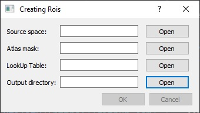

# Rois utility

This toolbox can be used to create [cartool](https://sites.google.com/site/cartoolcommunity/)'s Regions Of Interest files for solution point data.





In order to keep a smooth inverse solution, Cartool often positions solution points out of MRI greymask. This can lead to a loss of solution during regions of interest computation (solution points are either affected to white matter labels either to none). The toolbox tries answer this issue by use of K neighbourhood clustering.


First, the toolbox trains a KNN classifier using the MRI's voxels' positions and labels (excluding the unknown label [voxel data =0]).
Then it affect a label to each sources ( vote among the 5 closest voxels).  Finally, sources which don't have at least 5 voxels data in a 5 voxels radius around them are rejected.
Results are saved as a .rois file for further analysis. A Nifti file containing the solution points is also create for quality check. (It can be open in software such as freeview along with the lookUp table and other MRIs files.)

# Installation

To install the toolbox, clone this repository:
```
git clone https://github.com/Functional-Brain-Mapping-Laboratory/Rois_utility
```
Then go to the repository main folder and install dependencies:

```
cd Rois_utility
pip install -r requirements.txt
```

## Run

To run the toolbox, go to the repository main folder and type:

```
python -m rois
```


# Tips

You can compute the individuals atlases by use of the [Labelling utility](https://github.com/Functional-Brain-Mapping-Laboratory/Labelling_utility]) toolbox.

If you don't want sources to be attributed to white matters regions, make sources to use a mask without white matter labels. The can be achieved using the 'exclude' parameter of the [Labelling utility](https://github.com/Functional-Brain-Mapping-Laboratory/Labelling_utility]) toolbox.

Make sure to use the correct lookup table for each of the chosen atlas.

Always check your results either in cartool either in freeview by displaying your solution points together with your differents MRIs files (brain, greymask atlas, T1...)
